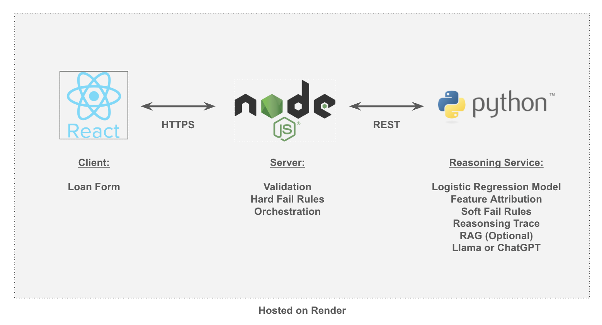

# Predicting the Probability of Loan Default for Loan Approvals using a Neurosymbolic AI Model

Author: Johann Zaroli

## Overview:  
  
Accurately vetting a loan candidate is a complex and risky process. Many factors play into approving a loan, opening the chance for errors in judgement. For lenders, the risk includes lost revenue, which can put even large financial institutions at risk of failure. For borrowers, debt can become burdensome or in the worst case, crippling, impacting quality of life and long term financial health. Equipping both parties with more transparency during the loan approval process can lead to a better mutual understanding, added trust, and mitigate long term, unforeseen risks to both parties.  
  
A hybrid AI model is the perfect architecture for mitigating loan default risks and providing much needed clarity to both parties. A machine learning model predicts the probability of default for an applicant. An added ontology and rule based layer approves or denies the applicant. A RAG pipeline adds domain intelligence. The final output is processed by an LLM, returning a concise summary of the candidate’s risk profile and application. This app combines all of these layers in an easy to use web application for usability.   
  
## Proposed Solution:  
  
A user will enter applicant information in a React.js front end. This information will be securely passed  to a Node.js server where the initial application information will undergo a deterministic check. This first tier checks for hard failures, immediately failing the applicant if the loan details are unserviceable. This reduces latency and costs to host the service.  
  
If the loan details are primed for the reasoning service, they will then be passed on to the machine learning algorithm to assess loan default risks. They will then pass a second, rules based check. The final details will be handed over to an LLM for interpretation, before being sent back to the client for the user to review. Note: A production grade system would leverage a RAG pipeline at this layer; adding additional clarity and context to the final loan approval summary.  
  
## Dataset:  
  
Give Me Some Credit: https://www.kaggle.com/competitions/GiveMeSomeCredit
The initial ML model will be trained on this smaller data set to keep training complexity down.

## Architecture:  
  

  
## Challenges:  
  
Latency can be a challenge with machine learning inference and working with third party integrations.
Proper exploratory data analysis will be conducted on the “Give Me Some Credit”, including a complete review of known loan default risks and loan application metrics. This dataset is subject to change depending on the needs for the Logistic Regression model.  
  
## Expected Outcome:  
  
A neurosymbolic AI model served through a simple to use web application, demonstrating the power of its hybrid architecture: with symbolic AI’s strengths in logical inference and with a neural networks’ ability for learning as well as pattern analysis.  
  
## References:
* https://alican-kiraz1.medium.com/nsai-neuro-symbolic-artificial-intelligence-systems-part-1-lnns-b22bfe2e7318 
* https://journals.theusinsight.com/index.php/AJAI/article/view/19
* https://www.mdpi.com/1999-4893/18/10/639
* https://proceedings.mlr.press/v284/chen25b.html
* https://arxiv.org/abs/2506.16335 
* https://www.wsj.com/articles/meet-neurosymbolic-ai-amazons-method-for-enhancing-neural-networks-620dd81a
